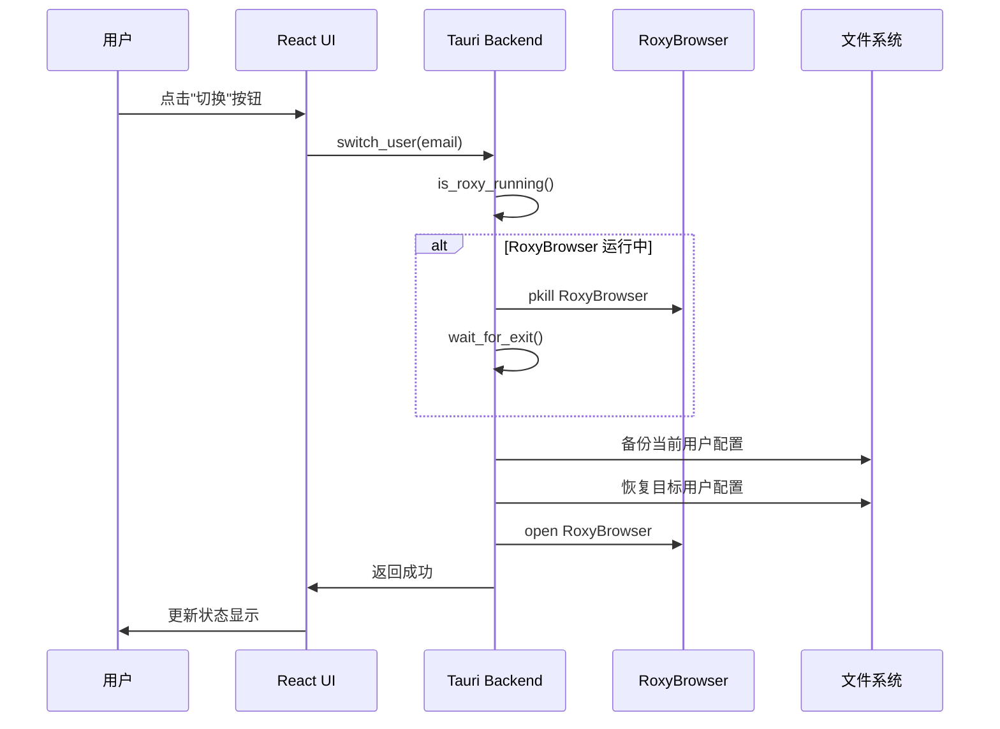
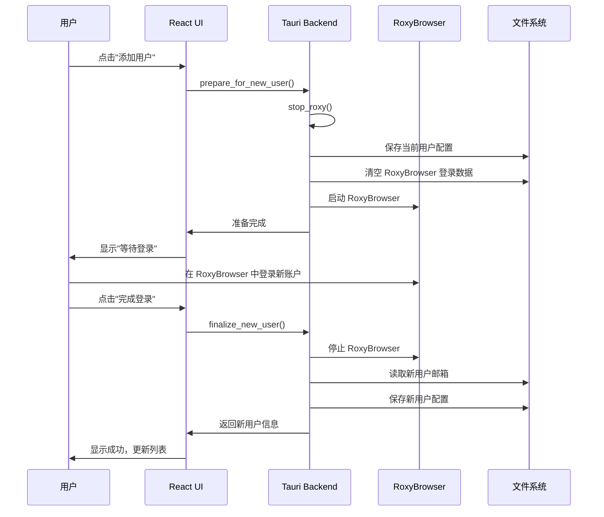

# RoxyBrowser Manager 实现计划

## 目标
开发一个跨平台桌面应用，用于管理和快速切换 RoxyBrowser 的多个登录用户账户。

---

## 技术栈 (参考 Antigravity-Manager)

| 层级 | 技术选型 | 说明 |
|------|----------|------|
| **框架** | Tauri v2 | 轻量级跨平台桌面框架 (Rust 后端) |
| **前端** | React 19 + TypeScript | 现代化 UI 开发 |
| **构建** | Vite | 快速开发构建 |
| **样式** | TailwindCSS + DaisyUI | 美观的 UI 组件库 |
| **状态** | Zustand | 轻量级状态管理 |
| **后端** | Rust + tokio | 异步运行时，处理文件操作 |
| **存储** | JSON 文件 | 简单的用户配置存储 |

---

## User Review Required

> [!IMPORTANT]
> **开发环境要求**：需要安装 Rust、Node.js 18+、Tauri CLI

> [!WARNING]
> **添加新用户流程**：用户需配合在引导状态下登录 RoxyBrowser，登录成功后由本工具保存配置。**切勿在 RoxyBrowser 中点退出登录**。

---

## 项目结构

```
Macos_RoxyBrowser_Manager/
├── PRD/                              # 需求文档
├── src/                              # 前端代码 (React)
│   ├── main.tsx                      # 入口
│   ├── App.tsx                       # 根组件
│   ├── components/                   # UI 组件
│   │   ├── Dashboard.tsx             # 主面板
│   │   ├── UserList.tsx              # 用户列表
│   │   ├── UserCard.tsx              # 用户卡片
│   │   ├── AddUserWizard.tsx         # 添加用户向导
│   │   └── StatusBar.tsx             # 状态栏
│   ├── stores/                       # 状态管理
│   │   └── useStore.ts               # Zustand store
│   ├── hooks/                        # 自定义 hooks
│   │   └── useTauri.ts               # Tauri 命令封装
│   └── styles/                       # 样式
│       └── index.css
├── src-tauri/                        # Rust 后端
│   ├── Cargo.toml                    # Rust 依赖
│   ├── tauri.conf.json               # Tauri 配置
│   └── src/
│       ├── main.rs                   # 入口
│       ├── lib.rs                    # 库入口
│       ├── commands/                 # Tauri 命令
│       │   ├── mod.rs
│       │   ├── process.rs            # 进程管理
│       │   └── profile.rs            # 配置文件管理
│       └── models/                   # 数据模型
│           ├── mod.rs
│           └── user.rs
├── package.json
├── vite.config.ts
├── tailwind.config.js
└── tsconfig.json
```

---

## Proposed Changes

### 后端 Rust 模块

#### [NEW] [src-tauri/src/commands/process.rs](file:///Users/evan/Documents/seafile/Seafile/00_Dev/Macos_RoxyBrowser_Manager/src-tauri/src/commands/process.rs)

进程管理命令：

```rust
#[tauri::command]
pub async fn is_roxy_running() -> Result<bool, String>

#[tauri::command]
pub async fn stop_roxy() -> Result<(), String>

#[tauri::command]
pub async fn start_roxy() -> Result<(), String>

#[tauri::command]
pub async fn get_roxy_status() -> Result<RoxyStatus, String>
```

---

#### [NEW] [src-tauri/src/commands/profile.rs](file:///Users/evan/Documents/seafile/Seafile/00_Dev/Macos_RoxyBrowser_Manager/src-tauri/src/commands/profile.rs)

配置文件管理命令：

```rust
// 需要备份的文件列表
const BACKUP_ITEMS: &[&str] = &[
    "config.json",
    "Local Storage",
    "Cookies",
    "Session Storage",
    "IndexedDB",
];

#[tauri::command]
pub async fn list_users() -> Result<Vec<UserProfile>, String>

#[tauri::command]
pub async fn save_current_user(email: String) -> Result<(), String>

#[tauri::command]
pub async fn switch_user(email: String) -> Result<(), String>

#[tauri::command]
pub async fn delete_user(email: String) -> Result<(), String>

#[tauri::command]
pub async fn get_current_user() -> Result<Option<String>, String>

#[tauri::command]
pub async fn prepare_for_new_user() -> Result<(), String>

#[tauri::command]
pub async fn finalize_new_user() -> Result<UserProfile, String>
```

---

### 前端 React 组件

#### [NEW] [src/components/Dashboard.tsx](file:///Users/evan/Documents/seafile/Seafile/00_Dev/Macos_RoxyBrowser_Manager/src/components/Dashboard.tsx)

主面板 UI：

```
┌─────────────────────────────────────────────────────────┐
│  🦊 RoxyBrowser Manager                          [─][×] │
├─────────────────────────────────────────────────────────┤
│                                                         │
│  ┌───────────────────────────────────────────────────┐  │
│  │  状态: ● RoxyBrowser 运行中                        │  │
│  │  当前用户: scaryhell@gmail.com                     │  │
│  └───────────────────────────────────────────────────┘  │
│                                                         │
│  用户列表                              [+ 添加用户]     │
│  ─────────────────────────────────────────────────────  │
│                                                         │
│  ┌───────────────────────────────────────────────────┐  │
│  │  👤 scaryhell@gmail.com              ● 当前       │  │
│  │     最后使用: 2024-01-22 21:00                    │  │
│  │                              [切换] [删除]        │  │
│  ├───────────────────────────────────────────────────┤  │
│  │  👤 yangf1023@gmail.com                           │  │
│  │     最后使用: 2024-01-20 15:30                    │  │
│  │                              [切换] [删除]        │  │
│  └───────────────────────────────────────────────────┘  │
│                                                         │
│  ┌─────────────┐  ┌──────────────┐  ┌───────────────┐   │
│  │  🚀 启动     │  │  ⏹️ 停止      │  │  🔄 刷新状态   │   │
│  └─────────────┘  └──────────────┘  └───────────────┘   │
└─────────────────────────────────────────────────────────┘
```

---

#### [NEW] [src/components/AddUserWizard.tsx](file:///Users/evan/Documents/seafile/Seafile/00_Dev/Macos_RoxyBrowser_Manager/src/components/AddUserWizard.tsx)

添加用户向导 (Modal)：

**步骤 1: 准备阶段**
```
┌───────────────────────────────────────────────────┐
│  添加新用户                                   [×] │
├───────────────────────────────────────────────────┤
│                                                   │
│  ⚠️ 重要提示                                       │
│                                                   │
│  1. 将自动保存当前用户配置                         │
│  2. 清空 RoxyBrowser 登录状态                     │
│  3. 启动 RoxyBrowser 供您登录新账户               │
│                                                   │
│  ⛔ 登录成功后，请直接关闭窗口或点击下方完成       │
│     切勿在 RoxyBrowser 中点击"退出登录"！         │
│                                                   │
│                      [ 取消 ]  [ 开始添加 → ]     │
└───────────────────────────────────────────────────┘
```

**步骤 2: 等待登录**
```
┌───────────────────────────────────────────────────┐
│  添加新用户 - 等待登录                        [×] │
├───────────────────────────────────────────────────┤
│                                                   │
│  ⏳ 请在 RoxyBrowser 中登录您的新账户              │
│                                                   │
│  RoxyBrowser 已启动，请完成登录                   │
│                                                   │
│  登录完成后，点击下方按钮保存                      │
│                                                   │
│                      [ ← 返回 ]  [ 完成登录 ✓ ]   │
└───────────────────────────────────────────────────┘
```

**步骤 3: 保存确认**
```
┌───────────────────────────────────────────────────┐
│  添加新用户 - 完成                            [×] │
├───────────────────────────────────────────────────┤
│                                                   │
│  ✅ 检测到新用户登录成功！                         │
│                                                   │
│  邮箱: yangf1023@gmail.com                        │
│                                                   │
│  是否保存此用户配置？                              │
│                                                   │
│                      [ 取消 ]  [ 保存用户 ✓ ]     │
└───────────────────────────────────────────────────┘
```

---

### 核心流程

#### 用户切换流程



#### 添加新用户流程



---

## 数据存储

### 用户配置文件 `~/.roxy_manager/config.json`

```json
{
  "version": 1,
  "currentUser": "scaryhell@gmail.com",
  "users": [
    {
      "email": "scaryhell@gmail.com",
      "displayName": "Scary Hell",
      "createdAt": "2024-01-15T10:00:00Z",
      "lastUsed": "2024-01-22T21:00:00Z"
    },
    {
      "email": "yangf1023@gmail.com",
      "displayName": "Yang F",
      "createdAt": "2024-01-10T08:00:00Z",
      "lastUsed": "2024-01-20T15:30:00Z"
    }
  ]
}
```

### 用户配置备份目录

```
~/.roxy_manager/profiles/
├── scaryhell@gmail.com/
│   ├── config.json
│   ├── Local Storage/
│   ├── Cookies
│   └── ...
└── yangf1023@gmail.com/
    ├── config.json
    ├── Local Storage/
    └── ...
```

---

## Verification Plan

### 开发环境测试

```bash
# 1. 安装依赖
cd /Users/evan/Documents/seafile/Seafile/00_Dev/Macos_RoxyBrowser_Manager
npm install

# 2. 开发模式运行
npm run tauri dev
```

### 手动测试用例

1. **启动/停止测试**：验证能正确检测和控制 RoxyBrowser 进程
2. **用户切换测试**：切换用户后 RoxyBrowser 能正确加载目标用户会话
3. **添加用户测试**：完成向导流程后新用户出现在列表中
4. **会话保持测试**：切换后原用户会话仍然有效

---

## 实施计划

| 阶段 | 任务 | 预计时间 |
|------|------|----------|
| 1 | 初始化 Tauri 项目 | 15 分钟 |
| 2 | 实现 Rust 后端命令 (process + profile) | 1 小时 |
| 3 | 实现 React UI 基础框架 | 30 分钟 |
| 4 | 实现 Dashboard 主面板 | 30 分钟 |
| 5 | 实现 AddUserWizard 向导 | 30 分钟 |
| 6 | 集成测试和调试 | 30 分钟 |
| 7 | 打包为 .app / .dmg | 15 分钟 |

**总计预估：约 3.5 小时**

---

## 依赖清单

### package.json

```json
{
  "dependencies": {
    "@tauri-apps/api": "^2",
    "@tauri-apps/plugin-fs": "^2",
    "@tauri-apps/plugin-process": "^2",
    "react": "^19",
    "react-dom": "^19",
    "zustand": "^5",
    "lucide-react": "^0.400",
    "daisyui": "^5",
    "clsx": "^2",
    "tailwind-merge": "^2"
  },
  "devDependencies": {
    "@tauri-apps/cli": "^2",
    "vite": "^6",
    "@vitejs/plugin-react": "^4",
    "tailwindcss": "^3",
    "typescript": "^5"
  }
}
```

### Cargo.toml

```toml
[dependencies]
tauri = { version = "2", features = ["tray-icon"] }
serde = { version = "1", features = ["derive"] }
serde_json = "1"
tokio = { version = "1", features = ["full"] }
sysinfo = "0.31"
dirs = "5"
```
