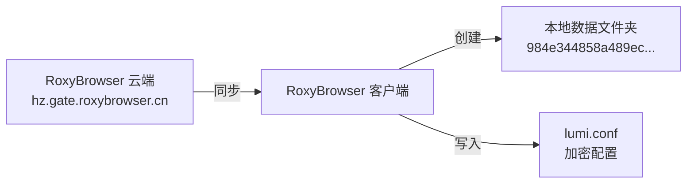

# RoxyBrowser 窗口名称与数据文件夹映射关系分析

## 概述

本文档分析了 RoxyBrowser 窗口名称（如 "窗口验证 KK"）与其数据文件夹（如 `984e344858a489ec61b3b69a605ef58a`）之间的关联关系。

## 关键发现

### 1. 映射关系存储位置

**核心结论**：窗口名称到数据文件夹的映射关系**存储在 RoxyBrowser 云端服务器**，而非本地文件系统中。

**数据流向**：



### 2. 本地文件结构

```
C:\Users\EVAN\AppData\Roaming\RoxyBrowser\
├── config.json                  ← 全局配置（加密）
├── browser-cache/
│   └── 984e344858a489ec61b3b69a605ef58a/   ← 窗口数据文件夹
│       ├── lumi.conf            ← 窗口配置（加密）⭐
│       ├── Local State          ← Chrome 引擎配置
│       ├── Default/             ← 浏览器 Profile 数据
│       │   └── Local Storage/   ← 本地存储数据
│       └── oss-session/         ← OSS 同步缓存
```

### 3. 关键标识符

从日志分析中提取的关键信息：

| 标识符 | 值 | 说明 |
|--------|-----|------|
| **dirId** | `984e344858a489ec61b3b69a605ef58a` | 本地数据文件夹名称（MD5 哈希） |
| **window.id** | `8638635` | 云端窗口 ID |
| **workspaceId** | `61462` / `69924` | 工作区 ID |

### 4. lumi.conf 文件分析

**路径**: `C:\Users\EVAN\AppData\Roaming\RoxyBrowser\browser-cache\984e344858a489ec61b3b69a605ef58a\lumi.conf`

**内容特征**:
- Base64 编码的加密数据
- 包含窗口配置信息（窗口名称、代理设置、指纹参数等）
- 使用 RoxyBrowser 私有加密算法

**示例内容（前100字符）**:
```
SyWIxONr5ef2lE+cLLaSItlSmvBIdEHasd5h6SZ5cCQ7zykN63SZZKfQQnOJLByFjxMrF89ax5/Wo...
```

> [!WARNING]
> `lumi.conf` 文件使用加密存储，无法直接读取窗口名称。

---

## RoxyBrowser 本地 API

### API 信息

| 属性 | 值 |
|------|-----|
| **地址** | `http://127.0.0.1:50000` |
| **协议** | HTTP REST API |
| **认证** | 需要 `workspaceId` 和 `token` 请求头 |

### 已知端点

- `POST /profiles` - 获取窗口列表（需要认证）
- `GET /api/browser/core-info` - 获取浏览器核心信息

### API 调用示例

```powershell
# 需要从活动会话中获取 token
$headers = @{
    "workspaceId" = "69924"
    "token" = "YOUR_TOKEN"
    "Content-Type" = "application/json"
}

Invoke-RestMethod -Uri "http://127.0.0.1:50000/profiles" `
    -Method POST `
    -Headers $headers `
    -Body '{"pageSize":100}'
```

> [!NOTE]
> API token 从日志中提取，可能会过期。建议使用官方 SDK。

---

## 云端同步机制

从日志分析，RoxyBrowser 使用以下云端服务：

### 服务端点

| 服务 | 地址 |
|------|------|
| **API 网关** | `https://hz.gate.roxybrowser.cn` |
| **OSS 存储** | 阿里云 OSS（用于同步浏览器缓存） |

### 同步路径

```
groupdata/workspace/{workspaceId}/window/{dirId}/browser-cache.zip
```

**示例**:
```
groupdata/workspace/61462/window/984e344858a489ec61b3b69a605ef58a/browser-cache.zip
```

---

## 如何获取窗口名称与文件夹映射

### 方法 1：通过 RoxyBrowser API（推荐）

1. 启用 RoxyBrowser API（在应用内设置）
2. 获取 API Key
3. 调用 `GET /profiles` 或 `POST /profiles` 端点
4. 响应中包含窗口 ID、名称和 dirId 的映射

### 方法 2：监听日志

RoxyBrowser 日志位于：
```
C:\Users\EVAN\AppData\Roaming\RoxyBrowser\logs\
```

日志中包含窗口操作记录，可以提取窗口 ID 与 dirId 的关系：

```log
[2026-02-04 08:13:57] Sync window open status on launch [ { id: 8638635, openStatus: true } ]
```

### 方法 3：解析 lumi.conf（不推荐）

需要逆向工程 RoxyBrowser 的加密算法，风险高且可能违反服务条款。

---

## 结论

1. **窗口名称 "窗口验证 KK"** 对应的数据文件夹是 `984e344858a489ec61b3b69a605ef58a`
2. **映射关系**存储在 RoxyBrowser 云端服务器，本地仅存储加密的 `lumi.conf`
3. **推荐方式**：使用 RoxyBrowser 官方 API 获取窗口列表和配置信息
4. **云端窗口 ID** 为 `8638635`，可用于 API 调用和日志追踪

---

## 参考信息

| 项目 | 值 |
|------|-----|
| RoxyBrowser 版本 | 3.7.1 |
| 分析日期 | 2026-02-04 |
| 数据文件夹 | `984e344858a489ec61b3b69a605ef58a` |
| 窗口名称 | 窗口验证 KK |
| 云端窗口 ID | 8638635 |
