# Roxy-Browser-Profile-Manager 项目分析与借鉴

## 1. 项目概述

**roxy-browser-profile-manager** 是一个基于 Node.js (Bun) + Express + SQLite 的 RoxyBrowser 配置文件管理工具，提供 Web UI 界面。

### 技术栈对比

| 维度 | roxy-browser-profile-manager | RoxyBrowser Manager (当前项目) |
|------|------------------------------|-------------------------------|
| **运行时** | Bun | Rust |
| **后端框架** | Express.js | Tauri |
| **前端** | HTML + TailwindCSS + JS | React + TypeScript |
| **数据库** | SQLite (Prisma ORM) | JSON 文件 |
| **打包方式** | 单可执行文件 (.exe) | 原生应用 (.app / .exe) |
| **平台** | Windows (主要) | macOS + Windows |

---

## 2. 核心功能对比

### 2.1 配置文件管理方式

#### roxy-browser-profile-manager 的方式

**数据存储位置**：
```
ROXY_BROWSER_PATH = C:\Users\xxx\AppData\Roaming\RoxyBrowser\browser-cache\
```

**关键发现** ⭐：
- **不是管理登录用户账号**，而是管理 **RoxyBrowser 的浏览器配置文件 (Profiles)**
- 每个配置文件就是一个**独立的浏览器窗口**，有自己的：
  - Cookies
  - Local Storage
  - 扩展程序
  - 浏览历史
  - 代理设置

**操作流程**：

```mermaid
graph LR
    A[RoxyBrowser 工作目录] -->|备份| B[backup-profiles/]
    B -->|恢复| A
    B -->|标签分类| C[SQLite 数据库]
    C -->|搜索筛选| D[Web UI]
```



**核心代码分析** ([`profileService.ts`](file:///Users/evan/Documents/seafile/Seafile/00_Dev/Github/roxy-browser-profile-manager/src/profileService.ts)):

```typescript
// 备份配置文件 = 复制整个目录
export async function backupProfile(
  sourceProfileId: string,      // 源配置文件 ID
  targetProfileId?: string,      // 备份 ID (可选，自动生成)
  description?: string           // 备份描述
): Promise<string> {
  const sourcePath = path.join(config.roxyBrowserPath, sourceProfileId);
  const destinationPath = path.join(config.backupFolderPath, finalTargetProfileId);
  
  // 关键操作：复制整个目录
  await copyDirectory(sourcePath, destinationPath);
  
  // 计算备份大小
  const backupSize = await getDirectorySize(destinationPath);
  
  // 保存元数据到数据库
  await createProfile(finalTargetProfileId, description, backupSizeInBytes);
}

// 恢复配置文件 = 复制回去
export async function restoreProfile(
  profileId: string,           // 备份 ID
  targetFolderId: string       // 目标文件夹（可以是新建的）
): Promise<void> {
  const backupPath = path.join(config.backupFolderPath, profileId);
  const targetPath = path.join(config.roxyBrowserPath, targetFolderId);
  
  // 关键操作：删除目标 + 复制备份
  const targetExists = await directoryExists(targetPath);
  if (targetExists) {
    await deleteDirectory(targetPath);
  }
  await copyDirectory(backupPath, targetPath);
}
```

#### RoxyBrowser Manager 的方式

**数据存储位置**：
```
源数据: ~/Library/Application Support/RoxyBrowser/
备份: ~/.roxy_manager/profiles/{email}/
```

**管理对象**：
- **登录用户账号**（email）
- 每个账号包含**完整的 RoxyBrowser 数据**
  - 所有配置文件
  - 所有窗口状态
  - 用户登录信息

**操作流程** ([`profile.rs`](file:///Users/evan/Documents/seafile/Seafile/00_Dev/RoxyBrowser_Manager/src-tauri/src/commands/profile.rs)):

```rust
// 备份整个用户的数据
fn backup_roxy_data(email: &str) -> Result<(), String> {
    let roxy_dir = get_roxy_data_dir();
    let profile_dir = get_profiles_dir().join(email);
    
    for item in BACKUP_ITEMS {
        let src = roxy_dir.join(item);
        let dst = profile_dir.join(item);
        
        if src.is_dir() {
            copy_dir_all(&src, &dst)?;
        } else {
            fs::copy(&src, &dst)?;
        }
    }
}

// 恢复整个用户的数据
fn restore_roxy_data(email: &str) -> Result<(), String> {
    let roxy_dir = get_roxy_data_dir();
    let profile_dir = get_profiles_dir().join(email);
    
    for item in BACKUP_ITEMS {
        let src = profile_dir.join(item);
        let dst = roxy_dir.join(item);
        
        // 删除现有 + 复制备份
        if dst.exists() {
            fs::remove_dir_all(&dst).ok();
        }
        copy_dir_all(&src, &dst)?;
    }
}
```

### 2.2 功能对比总结

| 功能 | roxy-browser-profile-manager | RoxyBrowser Manager |
|------|------------------------------|---------------------|
| **管理粒度** | 单个配置文件（窗口） | 完整用户账号 |
| **备份对象** | `browser-cache/{profile-id}/` | 整个 RoxyBrowser 数据目录 |
| **恢复机制** | 可恢复到任意文件夹 | 整体替换 |
| **元数据管理** | SQLite + 标签系统 | JSON 配置文件 |
| **搜索筛选** | 支持标签 + 描述搜索 | 仅用户列表 |
| **多账号切换** | ❌ 无此功能 | ✅ 核心功能 |

---

## 3. 关键技术差异

### 3.1 数据存储路径差异

**重大发现** 🔴：两个项目管理的**不是同一个数据目录**！

| 项目 | 管理路径 | 包含内容 |
|------|----------|----------|
| roxy-browser-profile-manager | `RoxyBrowser/browser-cache/` | **仅浏览器配置文件** |
| RoxyBrowser Manager | `RoxyBrowser/` | **完整用户数据** (包括 config.json, Local Storage, Cookies 等) |

**Windows 路径示例**：

```
C:\Users\xxx\AppData\Roaming\RoxyBrowser\
├── browser-cache/              ← roxy-browser-profile-manager 管理这里
│   ├── profile-id-1/
│   ├── profile-id-2/
│   └── ...
├── config.json                 ← RoxyBrowser Manager 管理这些
├── Local Storage/              ← RoxyBrowser Manager 管理这些
├── Cookies                     ← RoxyBrowser Manager 管理这些
└── IndexedDB/                  ← RoxyBrowser Manager 管理这些
```

**macOS 路径示例**：

```
~/Library/Application Support/RoxyBrowser/
├── browser-cache/              ← roxy-browser-profile-manager 管理这里 (如果有的话)
├── config.json                 ← RoxyBrowser Manager 管理
├── Local Storage/              ← RoxyBrowser Manager 管理
├── Cookies                     ← RoxyBrowser Manager 管理
└── IndexedDB/                  ← RoxyBrowser Manager 管理
```

### 3.2 "配置文件" 概念的混淆

**术语对比**：

| 概念 | roxy-browser-profile-manager | RoxyBrowser Manager |
|------|------------------------------|---------------------|
| **Profile** | 浏览器配置文件（一个窗口） | 用户备份配置 |
| **User** | 数据库中的用户表（未使用） | 登录账号 (email) |
| **Window** | ❌ 不涉及 | 等同于 Profile |

---

## 4. 对窗口转移功能的启发

### 4.1 可借鉴的技术点

#### ✅ 推荐借鉴：标签系统

**功能**：为配置文件/用户添加标签，方便分类管理

**数据库模型** ([`schema.prisma`](file:///Users/evan/Documents/seafile/Seafile/00_Dev/Github/roxy-browser-profile-manager/prisma/schema.prisma)):

```prisma
model Profile {
  profileId         String        @id
  description       String?
  backupSizeInBytes BigInt?
  createdAt         DateTime      @default(now())
  updatedAt         DateTime      @updatedAt
  tags              ProfileTag[]
}

model Tag {
  id        Int          @id @default(autoincrement())
  name      String       @unique
  createdAt DateTime     @default(now())
  profiles  ProfileTag[]
}

model ProfileTag {
  profileId String
  tagId     Int
  profile   Profile  @relation(fields: [profileId], references: [profileId], onDelete: Cascade)
  tag       Tag      @relation(fields: [tagId], references: [id], onDelete: Cascade)
  createdAt DateTime @default(now())

  @@id([profileId, tagId])
}
```

**借鉴建议**：
- 为 RoxyBrowser Manager 的**用户**添加标签功能
- 支持通过标签筛选用户
- 例如标签：`工作`、`个人`、`测试`、`美国账号`等

**实现成本**：⭐⭐ (低)

#### ✅ 推荐借鉴：灵活的恢复机制

**关键代码**：

```typescript
// 可以恢复到任意目标文件夹（不一定是原文件夹）
export async function restoreProfile(
  profileId: string,           // 备份 ID
  targetFolderId: string       // 可以是新建的文件夹名
): Promise<void> {
  const targetPath = path.join(config.roxyBrowserPath, targetFolderId);
  // ...
}
```

**借鉴思路**：
- 允许用户在**恢复时指定目标用户**
- 变相实现"窗口转移"：
  1. 用户 A 切换到活动状态
  2. 备份用户 A 的数据
  3. 切换到用户 B
  4. 将用户 A 的备份**恢复到用户 B 的数据目录**（智能合并）

#### ⚠️ 部分借鉴：备份大小统计

**功能**：计算每个备份的大小，方便管理磁盘空间

**代码** ([`fileUtils.ts:57-78`](file:///Users/evan/Documents/seafile/Seafile/00_Dev/Github/roxy-browser-profile-manager/src/fileUtils.ts#L57-L78)):

```typescript
export async function getDirectorySize(dirPath: string): Promise<number> {
  let totalSize = 0;
  const entries = await fs.readdir(dirPath, { withFileTypes: true });
  
  for (const entry of entries) {
    const fullPath = path.join(dirPath, entry.name);
    
    if (entry.isDirectory()) {
      totalSize += await getDirectorySize(fullPath);
    } else {
      const stats = await fs.stat(fullPath);
      totalSize += stats.size;
    }
  }
  
  return totalSize;
}
```

**借鉴建议**：
- 显示每个用户备份的大小
- 提供"清理空间"功能，删除长期未用的备份

#### ❌ 不推荐借鉴：SQLite 数据库

**原因**：
- 当前项目使用 JSON 配置文件已足够简单
- 添加数据库会增加复杂度
- 除非需要复杂查询（如标签筛选），否则不必要

---

### 4.2 窗口转移功能的新思路 💡

基于 roxy-browser-profile-manager 的设计，我们发现了两种可能的实现路径：

#### 方案 1：管理 browser-cache 层级

**思路**：
- 借鉴 roxy-browser-profile-manager 的设计
- 直接管理 `browser-cache/` 目录下的**单个配置文件**
- 实现真正的"窗口级别"管理

**优点**：
- ✅ 可以精确控制单个窗口
- ✅ 不影响用户登录状态
- ✅ 符合"窗口转移"的语义

**挑战**：
- ⚠️ 需要研究 `browser-cache/` 的结构
- ⚠️ 可能需要集成 RoxyBrowser API
- ⚠️ 与当前项目的架构差异较大

**实现成本**：⭐⭐⭐⭐ (高)

#### 方案 2：增强当前用户级管理

**思路**：
- 保持当前的用户级管理
- 添加"部分数据合并"功能
- 借鉴 roxy-browser-profile-manager 的标签系统

**具体实现**：

```rust
#[tauri::command]
pub fn merge_user_data(
    source_email: String,
    target_email: String,
    merge_options: MergeOptions,  // 新增：选择要合并的内容
) -> Result<MergeResult, String> {
    // 1. 备份目标用户数据
    let target_backup = create_temporary_backup(&target_email)?;
    
    // 2. 根据选项合并数据
    if merge_options.merge_cookies {
        merge_cookies(&source_email, &target_email)?;
    }
    
    if merge_options.merge_local_storage {
        merge_local_storage(&source_email, &target_email)?;
    }
    
    if merge_options.merge_browser_cache {
        // 这里可以合并 browser-cache 目录
        merge_browser_cache(&source_email, &target_email)?;
    }
    
    // 3. 验证合并结果
    verify_merge(&target_email)?;
    
    Ok(MergeResult {
        merged_items: vec![...],
        conflicts: vec![...],
        backup_path: target_backup,
    })
}
```

**优点**：
- ✅ 实现成本低
- ✅ 与现有架构兼容
- ✅ 用户体验清晰

**缺点**：
- ❌ 仍然无法做到真正的"单窗口转移"
- ❌ 需要处理数据合并冲突

**实现成本**：⭐⭐⭐ (中)

---

## 5. 具体建议

### 5.1 立即可实现的功能

#### 功能 1：用户数据合并 (基于方案 2)

**新增命令**：

```rust
// src-tauri/src/commands/profile.rs

/// 合并用户数据选项
#[derive(Debug, Serialize, Deserialize)]
pub struct MergeOptions {
    pub merge_cookies: bool,
    pub merge_local_storage: bool,
    pub merge_indexed_db: bool,
    pub merge_browser_cache: bool,  // 关键：合并浏览器配置文件
    pub overwrite_conflicts: bool,  // 冲突时是否覆盖
}

#[tauri::command]
pub fn merge_users(
    source_email: String,
    target_email: String,
    options: MergeOptions,
) -> Result<MergeResult, String> {
    // 实现智能合并逻辑
}
```

**UI 设计**：

```
┌─────────────────────────────────────────────┐
│     合并用户数据                              │
├─────────────────────────────────────────────┤
│ 源用户: yangf1023@gmail.com                  │
│ 目标用户: scaryhell@gmail.com                │
│                                              │
│ 选择要合并的数据:                             │
│ [✓] Cookies                                  │
│ [✓] Local Storage                            │
│ [✓] IndexedDB                                │
│ [✓] 浏览器配置文件 (browser-cache)            │
│                                              │
│ 冲突处理:                                     │
│ ( ) 跳过冲突项                                │
│ (•) 覆盖现有数据                              │
│ ( ) 保留两者（添加后缀）                       │
│                                              │
│ ⚠️  此操作会自动备份目标用户数据              │
│                                              │
│    [取消]           [开始合并]                │
└─────────────────────────────────────────────┘
```

**开发成本**：⭐⭐⭐ (中)  
**开发时间**：3-5 天  
**用户价值**：⭐⭐⭐⭐ (高)

#### 功能 2：标签系统

**数据结构**：

```rust
// src-tauri/src/models/user.rs

#[derive(Debug, Clone, Serialize, Deserialize)]
pub struct UserProfile {
    pub email: String,
    pub display_name: String,
    pub created_at: String,
    pub last_used: String,
    pub note: String,
    pub tags: Vec<String>,  // 新增：标签列表
}
```

**API**：

```rust
#[tauri::command]
pub fn add_user_tag(email: String, tag: String) -> Result<(), String> {
    // 为用户添加标签
}

#[tauri::command]
pub fn remove_user_tag(email: String, tag: String) -> Result<(), String> {
    // 移除用户标签
}

#[tauri::command]
pub fn filter_users_by_tags(tags: Vec<String>) -> Result<Vec<UserProfile>, String> {
    // 根据标签筛选用户
}
```

**开发成本**：⭐⭐ (低)  
**开发时间**：1-2 天  
**用户价值**：⭐⭐⭐ (中)

#### 功能 3：备份大小统计

**实现**：

```rust
#[tauri::command]
pub fn calculate_user_backup_size(email: String) -> Result<u64, String> {
    let profile_dir = get_profiles_dir().join(&email);
    let size = get_directory_size(&profile_dir)?;
    Ok(size)
}

#[tauri::command]
pub fn get_all_backups_size() -> Result<u64, String> {
    let profiles_dir = get_profiles_dir();
    let size = get_directory_size(&profiles_dir)?;
    Ok(size)
}
```

**UI 显示**：

```
用户列表:
┌────────────────────────────────────────┐
│ scaryhell@gmail.com                    │
│ 备份大小: 1.2 GB                        │
│ 上次使用: 2026-02-03                    │
│ 标签: [工作] [Google One]               │
└────────────────────────────────────────┘
```

**开发成本**：⭐ (极低)  
**开发时间**：0.5 天  
**用户价值**：⭐⭐ (低)

---

### 5.2 长期规划：集成 browser-cache 管理

**目标**：像 roxy-browser-profile-manager 一样，管理单个窗口配置文件

**阶段 1：研究 browser-cache 结构**
- 分析 macOS 和 Windows 上的 `browser-cache/` 目录结构
- 确认是否存在此目录
- 研究与 RoxyBrowser API 的关系

**阶段 2：添加窗口级备份**
- 在用户级备份基础上，增加窗口级备份
- 允许用户选择性备份某些窗口

**阶段 3：实现跨用户窗口转移**
- 将用户 A 的某个窗口配置
- 转移到用户 B 的 `browser-cache/` 目录

**预期收益**：
- 真正实现"窗口转移"功能
- 与 RoxyBrowser API 深度集成

**风险**：
- 需要逆向工程 RoxyBrowser 的数据结构
- 可能需要处理版本兼容性问题

---

## 6. 总结与建议

### 可行性评估

| 方案 | 可行性 | 开发成本 | 用户价值 | 推荐度 |
|------|--------|---------|---------|--------|
| 用户数据合并 | ✅ 高 | ⭐⭐⭐ 中 | ⭐⭐⭐⭐ 高 | ⭐⭐⭐⭐⭐ 强烈推荐 |
| 标签系统 | ✅ 高 | ⭐⭐ 低 | ⭐⭐⭐ 中 | ⭐⭐⭐⭐ 推荐 |
| 备份大小统计 | ✅ 高 | ⭐ 极低 | ⭐⭐ 低 | ⭐⭐⭐ 可选 |
| browser-cache 管理 | ⚠️ 中 | ⭐⭐⭐⭐⭐ 极高 | ⭐⭐⭐⭐⭐ 极高 | ⭐⭐ 长期规划 |

### 最终建议

> [!IMPORTANT]
> **推荐实现路径**：
> 
> 1. **第一阶段 (1-2 周)**：
>    - 实现用户数据合并功能（含 browser-cache 目录合并）
>    - 添加标签系统
>    - 提供清晰的冲突处理选项
> 
> 2. **第二阶段 (1-2 周)**：
>    - 添加备份大小统计
>    - 优化 UI 体验
>    - 添加操作历史记录（可回滚）
> 
> 3. **第三阶段 (研究为主)**：
>    - 研究 browser-cache 的结构
>    - 评估集成 RoxyBrowser API 的可能性
>    - 根据研究结果决定是否实现真正的"窗口转移"

> [!WARNING]
> **关键发现**：
> 
> - roxy-browser-profile-manager 和 RoxyBrowser Manager **管理的是不同层级的数据**
> - 前者管理**浏览器配置文件**（窗口级）
> - 后者管理**用户账号**（账号级）
> - 两者可以**互补**，而非竞争关系

### 代码复用建议

**可直接借鉴的代码**：

1. **目录复制逻辑** (`fileUtils.ts:22-37`)
2. **目录大小计算** (`fileUtils.ts:57-78`)
3. **标签系统数据模型** (`schema.prisma`)

**需要改造的代码**：

1. **备份恢复逻辑**：改为支持选择性合并
2. **API 端点**：改为 Tauri Command
3. **数据库**：改为 JSON 文件或轻量级存储

---

## 7. 相关文件

| 文件 | 说明 |
|------|------|
| [roxy-browser-profile-manager 项目](file:///Users/evan/Documents/seafile/Seafile/00_Dev/Github/roxy-browser-profile-manager) | 参考项目根目录 |
| [项目功能说明](file:///Users/evan/Documents/seafile/Seafile/00_Dev/Github/roxy-browser-profile-manager/PRD/项目功能说明.md) | 官方功能文档 |
| [profileService.ts](file:///Users/evan/Documents/seafile/Seafile/00_Dev/Github/roxy-browser-profile-manager/src/profileService.ts) | 核心业务逻辑 |
| [fileUtils.ts](file:///Users/evan/Documents/seafile/Seafile/00_Dev/Github/roxy-browser-profile-manager/src/fileUtils.ts) | 文件操作工具 |
| [schema.prisma](file:///Users/evan/Documents/seafile/Seafile/00_Dev/Github/roxy-browser-profile-manager/prisma/schema.prisma) | 数据库模型 |
| [窗口转移功能可行性分析](file:///Users/evan/Documents/seafile/Seafile/00_Dev/RoxyBrowser_Manager/PRD/窗口转移功能可行性分析.md) | 之前的分析文档 |
