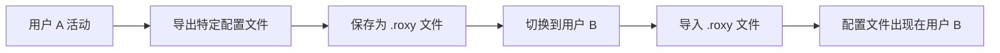

# RoxyBrowser Manager - 窗口转移功能可行性分析

## 1. 需求背景

**功能描述**：允许用户将 RoxyBrowser 中打开的窗口（浏览器配置文件/Profile窗口）从一个用户账户转移到另一个用户账户。

**应用场景**：
- 用户在账号 A 中打开了多个工作窗口，需要将某些窗口转移到账号 B
- 需要将特定项目的窗口迁移到另一个用户配置中
- 团队协作时，需要共享某些配置文件到不同账号

---

## 2. 当前数据结构分析

### 2.1 应用配置结构

**主配置文件路径**：`~/.roxy_manager/config.json`

```json
{
  "version": 1,
  "currentUser": "scaryhell@gmail.com",
  "users": [
    {
      "email": "scaryhell@gmail.com",
      "displayName": "scaryhell",
      "createdAt": "2026-01-22T22:41:13.734832+00:00",
      "lastUsed": "2026-02-03T14:32:35.965089+00:00",
      "note": "google 学生认证"
    }
  ]
}
```

**配置结构说明**：

| 字段 | 类型 | 说明 |
|------|------|------|
| `version` | u32 | 配置文件版本 |
| `currentUser` | Option\<String\> | 当前活动用户的邮箱 |
| `users` | Vec\<UserProfile\> | 用户列表 |

### 2.2 用户备份数据结构

**备份目录结构**：`~/.roxy_manager/profiles/{email}/`

每个用户的备份包含以下内容（对应 `BACKUP_ITEMS` 常量）：

```
~/.roxy_manager/profiles/yangf1023@gmail.com/
├── config.json           # RoxyBrowser 本地配置（加密数据）
├── Cookies              # Cookie 数据库
├── Local Storage/       # 本地存储
│   └── leveldb/         # LevelDB 数据库文件
├── Session Storage/     # 会话存储
└── IndexedDB/           # IndexedDB 数据库
```

**核心发现**：
- ✅ 所有用户数据都是**独立存储**的
- ✅ 每个用户有**完整的浏览器状态备份**
- ✅ 包含**登录凭证、Cookies、本地存储**等完整数据

### 2.3 RoxyBrowser 数据存储位置

**macOS**：`~/Library/Application Support/RoxyBrowser/`

**Windows**：`%AppData%\RoxyBrowser\`

**备份内容**（来自 `profile.rs:46-52`）：

```rust
const BACKUP_ITEMS: &[&str] = &[
    "config.json",       // 配置文件
    "Local Storage",     // 本地存储（包含用户登录信息）
    "Cookies",           // Cookie 数据
    "Session Storage",   // 会话存储
    "IndexedDB",         // IndexedDB 数据库
];
```

---

## 3. 窗口数据结构分析

### 3.1 RoxyBrowser 窗口管理机制

根据 [RoxyBrowser 快速切换用户可行性调研报告](file:///Users/evan/Documents/seafile/Seafile/00_Dev/RoxyBrowser_Manager/PRD/RoxyBrowser快速切换用户可行性调研报告.md)，RoxyBrowser 的窗口管理包括：

**核心概念**：
- **配置文件（Profile）**：每个窗口实际上是一个独立的浏览器配置文件
- **工作空间（Workspace）**：配置文件的分组容器
- **目录 ID（dirId）**：每个配置文件的唯一标识符

**RoxyBrowser API 支持**（端口 50000）：

| API 接口 | 功能 |
|----------|------|
| `/browser/workspace` | 获取工作空间和项目列表 |
| `/browser/list_v3` | 获取浏览器配置文件列表 |
| `/browser/detail` | 获取配置文件详情 |
| `/browser/open` | 打开指定配置文件 |
| `/browser/close` | 关闭指定配置文件 |

### 3.2 窗口数据存储位置

**关键发现**：窗口配置数据存储在以下位置：

1. **工作空间配置**：存储在 `Local Storage/leveldb/*` 中
2. **配置文件列表**：存储在 `config.json` 中（加密格式）
3. **会话状态**：存储在 `Session Storage` 中（仅当前会话）

**示例分析** - `config.json` 内容：
```
f96c77317886decffc2a67b3a70dd6de:be9cb5412e3f597a4ffb0684ff7a23cf...
```
> 这是加密的配置数据，包含了所有浏览器配置文件的元数据

---

## 4. 窗口转移功能技术可行性

### 4.1 数据层面可行性 ⚠️

| 维度 | 可行性 | 说明 |
|------|--------|------|
| **配置数据隔离** | ✅ 完全独立 | 每个用户的数据完全隔离，理论上可以合并 |
| **配置文件格式** | ❌ 加密存储 | `config.json` 是加密格式，无法直接解析 |
| **本地存储数据** | ⚠️ 部分可行 | LevelDB 格式可以读取，但需要处理冲突 |
| **Cookie 数据** | ✅ 可转移 | SQLite 格式，可以合并 |
| **IndexedDB** | ⚠️ 复杂 | 需要处理数据库冲突和版本兼容 |

### 4.2 技术挑战

#### 挑战 1：配置文件加密格式 🔴

**问题**：
- RoxyBrowser 的 `config.json` 是加密存储的
- 当前 Manager 只做**整体备份和恢复**，不解析内部结构
- 无法直接读取和修改配置文件中的窗口列表

**影响**：
- 无法精确识别哪些窗口属于哪个配置文件
- 无法单独提取某个窗口的配置

#### 挑战 2：数据库冲突 🟡

**问题**：
- 不同用户的 LevelDB / IndexedDB 可能有数据冲突
- 合并时需要处理键冲突、版本冲突

**示例**：
```
用户 A 的 Local Storage: userInfo -> {email: "a@gmail.com"}
用户 B 的 Local Storage: userInfo -> {email: "b@gmail.com"}
```
> 合并后会覆盖，导致用户信息错误

#### 挑战 3：RoxyBrowser API 限制 🟡

**现状**：
- RoxyBrowser API 支持**打开/关闭**配置文件
- 但**不支持跨账号转移**配置文件
- API 无法修改配置文件的归属关系

---

## 5. 替代方案分析

### 方案 A：完整用户数据迁移 ✅

**实现方式**：
- 将用户 A 的**所有窗口和配置**迁移到用户 B
- 实际上是**合并两个用户的备份数据**

**技术实现**：
```rust
fn merge_user_data(source_email: &str, target_email: &str) -> Result<(), String> {
    let source_dir = get_profiles_dir().join(source_email);
    let target_dir = get_profiles_dir().join(target_email);
    
    // 1. 备份目标用户数据
    backup_user_data(target_email)?;
    
    // 2. 复制源用户的所有数据到目标用户（会覆盖冲突）
    for item in BACKUP_ITEMS {
        let src = source_dir.join(item);
        let dst = target_dir.join(item);
        
        if dst.exists() {
            // 策略选择：覆盖 / 跳过 / 合并
            handle_conflict(&src, &dst)?;
        } else {
            copy_item(&src, &dst)?;
        }
    }
    
    Ok(())
}
```

**优缺点**：

| 优点 | 缺点 |
|------|------|
| ✅ 技术实现简单 | ❌ 无法精确控制单个窗口 |
| ✅ 不需要解析加密数据 | ❌ 可能覆盖目标用户的重要数据 |
| ✅ 可以立即实现 | ❌ 不是真正的"窗口转移" |

### 方案 B：通过 RoxyBrowser API 重建窗口 ⚠️

**实现方式**：
1. 通过 API 获取用户 A 的窗口列表
2. 在用户 B 中**重新创建相同配置的窗口**
3. 但**不包含登录状态和历史数据**

**技术实现**：
```python
# 1. 切换到用户 A，获取窗口列表
windows = api.get_window_list()

# 2. 记录窗口配置
window_configs = [
    {
        "workspace_id": w.workspace_id,
        "profile_name": w.profile_name,
        "settings": w.settings  # 代理、UserAgent等
    }
    for w in windows
]

# 3. 切换到用户 B，重建窗口
switch_user("user_b@gmail.com")
for config in window_configs:
    api.create_profile(config)
```

**优缺点**：

| 优点 | 缺点 |
|------|------|
| ✅ 精确控制单个窗口 | ❌ 丢失登录状态和 Cookies |
| ✅ 不会覆盖现有数据 | ❌ 需要重新登录所有网站 |
| ✅ 更符合"转移"语义 | ❌ 依赖 RoxyBrowser API 版本 |

### 方案 C：导出/导入配置文件 ✅ (推荐)

**实现方式**：
- 利用 RoxyBrowser 自带的**配置文件导出功能**
- 将配置文件从用户 A 导出，在用户 B 中导入

**流程**：


**技术实现**：
```rust
// 1. 添加导出单个配置文件功能
#[tauri::command]
pub fn export_profile_from_user(
    user_email: String,
    profile_id: String,  // 从 API 获取
    export_path: String
) -> Result<(), String> {
    // 调用 RoxyBrowser API 导出
    // 或手动从 leveldb 中提取配置
}

// 2. 添加导入配置文件到指定用户
#[tauri::command]
pub fn import_profile_to_user(
    user_email: String,
    profile_path: String
) -> Result<(), String> {
    // 切换到目标用户
    switch_user(user_email)?;
    
    // 调用 RoxyBrowser API 导入
    // 或手动注入到 leveldb
}
```

**优缺点**：

| 优点 | 缺点 |
|------|------|
| ✅ 符合 RoxyBrowser 设计理念 | ⚠️ 需要逆向工程 .roxy 文件格式 |
| ✅ 可以保留大部分配置 | ⚠️ 可能丢失部分运行时数据 |
| ✅ 用户体验好 | ⚠️ 开发复杂度中等 |

---

## 6. 推荐实现方案

### 阶段 1：快速实现（MVP） - 用户级数据共享

**功能**：
- 添加"复制用户数据"功能
- 将用户 A 的**所有窗口和配置**复制到用户 B
- 提供冲突处理选项（覆盖/跳过）

**实现要点**：
```rust
#[tauri::command]
pub fn copy_user_profiles(
    source_email: String,
    target_email: String,
    merge_strategy: MergeStrategy  // Overwrite / Skip / Backup
) -> Result<CopyResult, String> {
    // 1. 验证两个用户都存在
    // 2. 备份目标用户数据（以防万一）
    // 3. 根据策略复制数据
    // 4. 返回复制结果报告
}
```

**开发成本**：⭐⭐ (低)  
**上线时间**：1-2 天  
**风险**：低

### 阶段 2：增强版 - 基于 API 的配置文件转移

**前提**：需要研究 RoxyBrowser 的配置文件格式

**功能**：
- 调用 RoxyBrowser API 获取窗口列表
- 允许用户**选择特定窗口**进行转移
- 在目标用户中**重建窗口配置**（不含登录状态）

**实现要点**：
```rust
#[tauri::command]
pub fn transfer_windows(
    source_email: String,
    target_email: String,
    window_ids: Vec<String>
) -> Result<TransferResult, String> {
    // 1. 切换到源用户
    // 2. 通过 API 获取窗口配置
    // 3. 切换到目标用户
    // 4. 通过 API 创建窗口
}
```

**开发成本**：⭐⭐⭐⭐ (中高)  
**上线时间**：1-2 周  
**风险**：中等（依赖 RoxyBrowser API 稳定性）

### 阶段 3：完整版 - 数据库级别的配置迁移

**前提**：需要逆向工程 `config.json` 加密格式和 LevelDB 数据结构

**功能**：
- 解析加密的 `config.json`
- 精确提取单个配置文件的所有数据
- 合并到目标用户的数据库中
- **保留登录状态、Cookies、历史记录**

**风险**：⭐⭐⭐⭐⭐ (高)  
**开发成本**：非常高  
**不推荐原因**：
- 可能违反 RoxyBrowser 的 ToS
- 加密格式可能随版本变化
- 维护成本极高

---

## 7. 结论与建议

### 可行性评估

| 方案 | 可行性 | 开发难度 | 用户价值 | 推荐度 |
|------|--------|---------|---------|--------|
| 方案 A：用户数据迁移 | ✅ 高 | ⭐⭐ 低 | ⭐⭐⭐ 中 | ⭐⭐⭐⭐ 推荐 |
| 方案 B：API 重建窗口 | ⚠️ 中 | ⭐⭐⭐⭐ 中高 | ⭐⭐⭐ 中 | ⭐⭐⭐ 可选 |
| 方案 C：配置文件导入 | ⚠️ 中 | ⭐⭐⭐⭐ 中高 | ⭐⭐⭐⭐ 高 | ⭐⭐⭐⭐ 推荐 |
| 数据库级迁移 | ❌ 低 | ⭐⭐⭐⭐⭐ 极高 | ⭐⭐⭐⭐⭐ 极高 | ⭐ 不推荐 |

### 最终建议

> [!IMPORTANT]
> **推荐实现方案 A（用户数据迁移）作为第一版功能**：
> 
> 1. **功能定位**：将功能命名为"合并用户数据"而非"窗口转移"
> 2. **用户体验**：
>    - 提供清晰的警告：此操作会将源用户的所有数据复制到目标用户
>    - 自动备份目标用户数据，支持回滚
>    - 提供冲突处理选项
> 3. **适用场景**：
>    - 账号整合（将多个测试账号合并到主账号）
>    - 数据迁移（从旧账号迁移到新账号）
>    - 配置复用（将常用配置复制到新用户）

> [!WARNING]
> **不建议实现真正的"单窗口转移"功能**，原因：
> 
> - RoxyBrowser 的加密机制使得精确提取单个窗口的数据非常困难
> - 开发和维护成本远超用户价值
> - 可能存在法律和技术风险

### 后续优化方向

如果方案 A 获得用户好评，可以考虑：
1. **集成 RoxyBrowser API**：实现基于 API 的窗口列表查看
2. **选择性数据复制**：允许用户选择要复制的数据类型（仅配置/含Cookies/全部）
3. **智能合并**：检测重复配置文件，避免冲突

---

## 8. 附录：相关代码文件

| 文件 | 功能 | 需要修改 |
|------|------|----------|
| [`models/user.rs`](file:///Users/evan/Documents/seafile/Seafile/00_Dev/RoxyBrowser_Manager/src-tauri/src/models/user.rs) | 用户数据结构定义 | ✅ 需要扩展 |
| [`commands/profile.rs`](file:///Users/evan/Documents/seafile/Seafile/00_Dev/RoxyBrowser_Manager/src-tauri/src/commands/profile.rs) | 用户配置管理 | ✅ 主要修改文件 |
| [`commands/process.rs`](file:///Users/evan/Documents/seafile/Seafile/00_Dev/RoxyBrowser_Manager/src-tauri/src/commands/process.rs) | 进程管理 | ❌ 无需修改 |
| [`lib.rs`](file:///Users/evan/Documents/seafile/Seafile/00_Dev/RoxyBrowser_Manager/src-tauri/src/lib.rs) | Tauri 应用入口 | ✅ 注册新命令 |

---

## 9. 参考资料

- [RoxyBrowser 快速切换用户可行性调研报告](file:///Users/evan/Documents/seafile/Seafile/00_Dev/RoxyBrowser_Manager/PRD/RoxyBrowser快速切换用户可行性调研报告.md)
- [RoxyBrowser API 文档](https://faq.roxybrowser.com/api-documentation/api-reference.html)
- [LevelDB 数据库格式文档](https://github.com/google/leveldb/blob/main/doc/index.md)
- [当前用户配置数据](file:///Users/evan/.roxy_manager/config.json)
