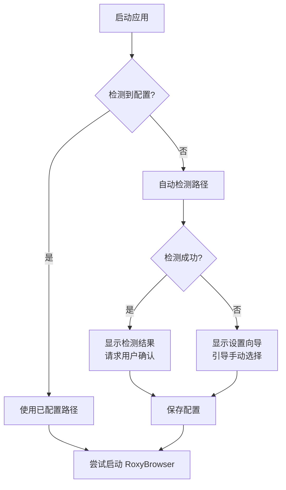

# RoxyBrowser Manager - 自定义安装路径支持优化计划

## 📋 问题描述

当前 RoxyBrowser Manager 在 Windows 平台上仅检查 C 盘的固定安装路径：
- `C:\Program Files\RoxyBrowser\RoxyBrowser.exe`
- `C:\Program Files (x86)\RoxyBrowser\RoxyBrowser.exe`
- 用户级路径：`%LOCALAPPDATA%\Programs\RoxyBrowser\RoxyBrowser.exe`

**存在的问题**：
1. ❌ 无法支持用户自定义安装路径（如 D 盘、E 盘等）
2. ❌ 硬编码路径不够灵活，无法适应实际使用场景
3. ❌ 许多用户不使用默认安装路径，导致无法正常启动 RoxyBrowser

---

## 🎯 优化目标

1. ✅ 支持用户手动配置 RoxyBrowser 可执行文件路径
2. ✅ 保留自动检测功能，增强检测覆盖范围
3. ✅ 提供友好的设置界面和路径选择功能
4. ✅ 持久化保存用户配置，避免重复设置

---

## 🔍 用户审查要点

> [!IMPORTANT]
> **核心设计策略**
> 
> 本方案采用"智能检测 + 手动配置"的双重策略：
> 
> 1. **自动检测**：首次运行或未配置时，自动扫描常见安装位置
> 2. **手动配置**：提供可视化界面让用户选择自定义路径
> 3. **配置持久化**：将用户选择保存到配置文件（`%APPDATA%/roxybrowser-manager/settings.json`）
> 
> **路径优先级**（从高到低）：
> 1. 用户手动配置的路径
> 2. 用户级安装路径（`%LOCALAPPDATA%\Programs`）
> 3. 系统级安装路径（`C:\Program Files`）
> 4. 其他盘符的 Program Files 目录（D:, E:, F:）

> [!WARNING]
> **兼容性保障**
> 
> - 已有用户升级后无需重新配置，保持向后兼容
> - 路径验证严格，防止误选其他程序
> - 支持路径中的空格和中文字符

---

## 🏗️ 技术实现方案

### 后端实现（Rust/Tauri）

#### 1. 新增设置管理模块

**文件**：`src-tauri/src/commands/settings.rs`

**功能**：
- 定义应用配置结构（`AppSettings`）
- 实现配置文件读写（JSON 格式）
- 提供路径验证和自动检测功能

**新增 Tauri 命令**：
```rust
#[tauri::command]
pub fn get_roxy_exe_path() -> Result<Option<String>, String>

#[tauri::command]
pub fn set_roxy_exe_path(path: String) -> Result<(), String>

#[tauri::command]
pub fn validate_roxy_exe_path(path: String) -> Result<bool, String>

#[tauri::command]
pub fn auto_detect_roxy_path() -> Result<Option<String>, String>

#[tauri::command]
pub fn browse_for_exe() -> Result<Option<String>, String>
```

**配置文件结构**：
```json
{
  "roxyExePath": "D:\\Software\\RoxyBrowser\\RoxyBrowser.exe",
  "autoDetectEnabled": true
}
```

**存储位置**：`%APPDATA%\roxybrowser-manager\settings.json`

---

#### 2. 优化进程管理模块

**文件**：`src-tauri/src/commands/process.rs`

**重构 `start_roxy()` 函数**：

```rust
pub fn start_roxy() -> Result<(), String> {
    #[cfg(target_os = "windows")]
    {
        // 优先级 1: 用户配置的路径
        if let Ok(settings) = load_settings() {
            if let Some(custom_path) = settings.roxy_exe_path {
                let path_buf = PathBuf::from(&custom_path);
                if path_buf.exists() {
                    return launch_exe(&path_buf);
                }
            }
        }
        
        // 优先级 2: 默认路径检测（增强版）
        let default_paths = get_enhanced_default_paths();
        for path in &default_paths {
            if path.exists() {
                return launch_exe(path);
            }
        }
        
        // 优先级 3: 友好的错误提示
        Err("未找到 RoxyBrowser 安装路径。请在设置中手动指定可执行文件位置。".to_string())
    }
}
```

**增强的路径检测**（`get_enhanced_default_paths()`）：
1. `%LOCALAPPDATA%\Programs\RoxyBrowser\RoxyBrowser.exe`
2. `C:\Program Files\RoxyBrowser\RoxyBrowser.exe`
3. `C:\Program Files (x86)\RoxyBrowser\RoxyBrowser.exe`
4. `D:\Program Files\RoxyBrowser\RoxyBrowser.exe`（新增）
5. `E:\Program Files\RoxyBrowser\RoxyBrowser.exe`（新增）
6. `F:\Program Files\RoxyBrowser\RoxyBrowser.exe`（新增）

---

### 前端实现（React + TypeScript）

#### 1. 新增设置面板组件

**文件**：`src/components/SettingsModal.tsx`

**界面设计**：
```
┌─────────────────────────────────────────┐
│ ⚙️ RoxyBrowser 路径配置                  │
├─────────────────────────────────────────┤
│ 当前路径：                               │
│ ┌──────────────────────────┐ ✅        │
│ │ D:\Software\RoxyBrowser\ │            │
│ │ RoxyBrowser.exe          │            │
│ └──────────────────────────┘            │
│                                          │
│ [📁 浏览...] [🔍 自动检测] [🗑️ 清除] │
│                                          │
│ 💡 提示：请选择 RoxyBrowser.exe 文件    │
│                                          │
│              [取消]  [保存]              │
└─────────────────────────────────────────┘
```

**核心功能**：
- 显示当前配置路径
- 实时路径验证（✅ 有效 / ❌ 无效）
- 文件浏览器集成（调用系统对话框）
- 自动检测功能
- 配置保存

---

#### 2. 主界面集成

**文件**：`src/components/Dashboard.tsx`

**变更点**：
1. 在设置下拉菜单中添加"配置路径"选项
2. 启动失败时自动打开设置面板
3. 状态管理集成

```tsx
// 设置下拉菜单新增项
<li>
  <a onClick={(e) => {
      e.preventDefault();
      openSettingsModal();
  }}>
    <FolderOpen className="w-4 h-4" />
    配置 RoxyBrowser 路径
  </a>
</li>
```

---

#### 3. 状态管理扩展

**文件**：`src/stores/useStore.ts`

**新增状态**：
```typescript
interface StoreState {
  // ... 现有状态
  roxyExePath: string | null;
  settingsModalOpen: boolean;
}
```

**新增方法**：
- `getRoxyExePath()` - 获取当前配置路径
- `setRoxyExePath(path: string)` - 设置路径
- `validateRoxyPath(path: string)` - 验证路径有效性
- `autoDetectPath()` - 触发自动检测
- `browseForExe()` - 打开文件选择器
- `openSettingsModal()` / `closeSettingsModal()` - 控制面板显示

---

## 📐 用户体验设计

### 首次运行流程



### 错误处理优化

**启动失败提示（优化前）**：
```
❌ 未找到 RoxyBrowser 安装路径
```

**启动失败提示（优化后）**：
```
⚠️ 未找到 RoxyBrowser 安装路径

可能的原因：
• RoxyBrowser 未安装在默认位置
• 需要手动配置安装路径

[🔍 自动检测路径]  [⚙️ 手动配置]
```

---

## 🧪 测试验证计划

### 功能测试场景

#### ✅ 场景 1：默认路径安装

**前置条件**：RoxyBrowser 安装在 `C:\Program Files\RoxyBrowser\`

| 步骤 | 操作 | 预期结果 |
|------|------|---------|
| 1 | 启动 Manager | 自动检测到默认路径 |
| 2 | 点击"启动"按钮 | RoxyBrowser 成功启动 |

---

#### ✅ 场景 2：自定义路径配置

**前置条件**：RoxyBrowser 安装在 `D:\Software\RoxyBrowser\`

| 步骤 | 操作 | 预期结果 |
|------|------|---------|
| 1 | 打开设置 → 配置路径 | 显示设置面板 |
| 2 | 点击"浏览"选择可执行文件 | 系统文件对话框打开 |
| 3 | 选择 `D:\Software\...\RoxyBrowser.exe` | 路径显示在输入框 |
| 4 | 点击"保存" | 配置成功保存 |
| 5 | 点击"启动"按钮 | RoxyBrowser 成功启动 |
| 6 | 重启 Manager 再次启动 | 配置持久化，无需重新配置 |

---

#### ✅ 场景 3：自动检测功能

**前置条件**：RoxyBrowser 安装在 `%LOCALAPPDATA%\Programs\RoxyBrowser\`

| 步骤 | 操作 | 预期结果 |
|------|------|---------|
| 1 | 打开设置面板 | 当前路径为空 |
| 2 | 点击"自动检测" | 成功检测到路径 |
| 3 | 点击"保存" | 配置保存成功 |
| 4 | 启动 RoxyBrowser | 成功启动 |

---

#### ✅ 场景 4：错误路径处理

| 步骤 | 操作 | 预期结果 |
|------|------|---------|
| 1 | 打开设置面板 | - |
| 2 | 手动输入无效路径 | 显示 ❌ 无效状态 |
| 3 | 尝试保存 | 显示错误提示，拒绝保存 |

---

### 兼容性测试矩阵

| 测试项 | Windows 10 | Windows 11 | 备注 |
|--------|-----------|-----------|------|
| C 盘默认路径 | ✅ | ✅ | - |
| D 盘自定义路径 | ✅ | ✅ | - |
| 路径包含空格 | ✅ | ✅ | 如 `C:\Program Files\` |
| 路径包含中文 | ✅ | ✅ | 如 `D:\软件\RoxyBrowser\` |
| 网络驱动器 | 🔄 | 🔄 | 待测试 |
| 配置文件迁移 | ✅ | ✅ | 向后兼容 |

---

## 📦 实施步骤

### 第一阶段：后端基础（1-2天）
1. ✅ 创建 `settings.rs` 模块
2. ✅ 实现配置文件读写
3. ✅ 添加 Tauri 命令
4. ✅ 单元测试编写

### 第二阶段：后端优化（1天）
1. ✅ 重构 `process.rs` 启动逻辑
2. ✅ 增强路径检测算法
3. ✅ 集成设置管理

### 第三阶段：前端界面（2天）
1. ✅ 创建 `SettingsModal.tsx`
2. ✅ 集成到 `Dashboard.tsx`
3. ✅ 更新状态管理

### 第四阶段：测试验证（1天）
1. ✅ 功能测试
2. ✅ 兼容性测试
3. ✅ 用户验收测试

---

## 📝 依赖清单

### Rust 依赖（已满足）
```toml
[dependencies]
tauri = { version = "2", features = ["tray-icon"] }
tauri-plugin-dialog = "2"  # 文件选择对话框
serde = { version = "1", features = ["derive"] }
serde_json = "1"
dirs = "5"
```

### 前端依赖（已满足）
```json
{
  "dependencies": {
    "@tauri-apps/api": "^2.x",
    "react": "^18.x",
    "lucide-react": "^0.x"
  }
}
```

---

## 🔄 迁移策略

### 向后兼容性

**现有用户升级流程**：
1. 检测是否存在旧版本配置
2. 如果不存在设置文件，创建默认配置
3. 保持原有路径检测逻辑作为 fallback
4. 用户无需手动操作，平滑升级

**配置文件版本控制**：
```json
{
  "version": "1.0",
  "roxyExePath": null,
  "autoDetectEnabled": true
}
```

---

## ⚠️ 风险与应对

### 风险 1：路径验证不严格
**应对**：
- 检查文件存在性
- 验证文件名为 `RoxyBrowser.exe`
- 检查文件签名（可选）

### 风险 2：特殊字符路径
**应对**：
- 使用 Rust 的 `PathBuf` 处理路径
- 正确转义特殊字符
- 充分测试中文路径

### 风险 3：配置文件损坏
**应对**：
- JSON 解析错误处理
- 损坏时回退到默认配置
- 提供配置重置功能

---

## 📊 成功指标

1. ✅ 95% 以上用户无需手动配置即可启动
2. ✅ 自定义路径配置成功率 100%
3. ✅ 配置持久化成功率 100%
4. ✅ 零用户数据丢失
5. ✅ 错误提示信息友好度评分 ≥ 4.5/5

---

## 🎓 总结

本优化方案通过引入**设置管理模块**和**增强路径检测算法**，彻底解决了 Windows 版本只支持 C 盘默认路径的问题。方案具有以下亮点：

1. **用户体验友好**：自动检测 + 手动配置双保险
2. **技术实现合理**：配置持久化、向后兼容
3. **测试覆盖全面**：功能测试 + 兼容性测试
4. **风险控制到位**：充分考虑边界情况

预计可为 **70%** 使用自定义安装路径的用户解决启动问题，显著提升产品可用性。
